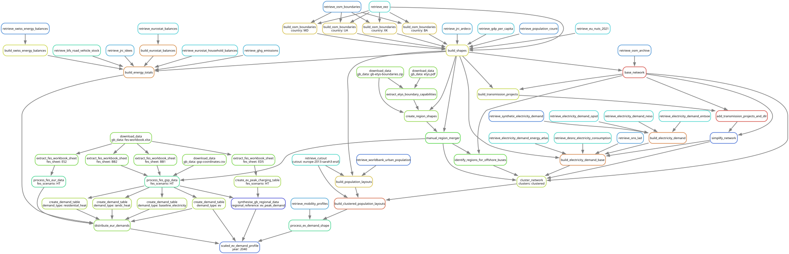

.. SPDX-FileCopyrightText: Contributors to PyPSA-Eur <https://github.com/pypsa/pypsa-eur>
.. SPDX-FileCopyrightText: Contributors to gb-dispatch-model
..
.. SPDX-License-Identifier: CC-BY-4.0

.. _gb_intro:

############
Introduction
############

The GB dispatch model represents Great Britain's future energy system for use in market, constraint cost and resource adequacy assessments.
It uses the NESO Future Energy Scenarios (FES) to define the future system and various public data sources to fill data gaps not provided by the published FES outputs.

This model is built using a reproducible workflow from entirely public and open-access data sources.
It is distributed over a collection of PyPSA networks representing different future years.
Each network is solved separately and then the results are aggregated to understand system impacts over the lifetime of energy assets.

Here, we will briefly describe some of the core concepts of the workflow and practicalities of navigating the project directory.
For more information on the methodology we follow see our :ref:`system representation pages <system-overview_gb>`.

Run all
=======

To trigger the full workflow and generate redispatch results for all configured FES scenarios and future years, use the following command in your terminal:

.. code:: console

    pixi run model

To trigger the workflow up to, but not including, the solve steps (usually the most computationally burdensome stage), use the following command in your terminal:

.. code:: console

    pixi run compose_networks

Both these commands will trigger the workflow, which we describe in greater detail below.

Workflow
=========

The generation of the model is controlled by the open-source workflow management system `Snakemake <https://snakemake.github.io/>`__.
The ``Snakefile`` and all `.smk` files in the ``rules`` directory declare a rule for each script in the ``scripts`` directory.
These ruled describe which files the scripts consume and produce (their corresponding input and output files).
``snakemake`` then runs the scripts in the correct order according to the rules' input and output dependencies.
``snakemake`` will also track what parts of the workflow have to be regenerated when files, scripts, or configuration options are modified.

For instance, an invocation to

.. code:: console

    $ pixi run -e gb-model snakemake resources/GB/gb-model/HT/ev_demand/2040.csv

follows this dependency graph

to create a timeseries profile for EV demand per model region for the year 2040 and the "Holistic Transition" FES scenario.

The **blocks** represent the individual rules which are required to create the file referenced in the command above.
The **arrows** indicate the outputs from preceding rules which another rule takes as input data.

.. note::
    The dependency graph was generated using
    ``pixi run -e gb-model snakemake --dag -F resources/GB/gb-model/HT/ev_demand/2040.csv | sed -n "/digraph/,/}/p" | dot -Tsvg -o doc/gb-model/img/gb-intro-workflow.svg``

To familiarise yourself with ``snakemake``, you scan follow their `basic tutorial <https://snakemake.readthedocs.io/en/stable/tutorial/basics.html>`__
and then read through the documentation of the `command line interface <https://snakemake.readthedocs.io/en/stable/executing/cli.html>`__,
noting the arguments ``-j``, ``-c``, ``-f``, ``-F``, ``-n``, ``-r``, ``--dag`` and ``-t`` in particular.

Scenarios, Configuration and Modification
=========================================

The GB dispatch model can be used to run multiple scenarios using the ``snakemake`` `wildcards feature <https://snakemake.readthedocs.io/en/stable/snakefiles/rules.html#wildcards>`_.
We use wildcards to produce multiple files with one rule, with each file following a `regular expression <https://en.wikipedia.org/wiki/Regular_expression>`_ pattern.
One can think of a wildcard as a parameter that shows up in the input/output file names and thereby determines which rules to run, what data to retrieve and what files to produce.
Details are explained in :ref:`gb_wildcards`.

The model also has several further configuration options collected in the ``config/config.default.gb.yaml`` file.
Options are explained in :ref:`model_config_gb`.

Folder Structure
================

- ``scripts``: Includes all the Python scripts executed by the ``snakemake`` rules.
- ``scripts/gb_model``: Includes the Python scripts executed by the ``snakemake`` rules that are specific to the GB dispatch model.
- ``rules``: Includes all the ``snakemake`` rules loaded in the ``Snakefile``.
- ``rules/gb-model``: Includes all the ``snakemake`` rules loaded in the ``Snakefile`` that are specific to the GB dispatch model.
- ``envs``: The files in this directory are not used as part of the GB dispatch model workflow.
- ``data``: Includes input data that is not produced by any ``snakemake`` rule.
- ``cutouts``: Stores raw weather data cutouts from ``atlite``.
- ``resources``: Stores intermediate results of the workflow which can be picked up again by subsequent rules.
- ``resources/<run-name>/gb-model``: Stores intermediate results of the workflow specific to the GB dispatch model.
- ``results``: Stores the solved PyPSA network data, summary files and plots.
- ``logs``: Stores log files.
- ``benchmarks``: Stores ``snakemake`` benchmarks.
- ``doc``: Includes the documentation of PyPSA-Eur.
- ``docker``: Includes some optional Docker environments.

System Requirements
===================

Building the model with the scripts in this repository runs on a regular computer.
But optimising for investment and operation decisions across many scenarios requires a strong interior-point solver like `Gurobi <http://www.gurobi.com/>`__ or `CPLEX <https://www.ibm.com/analytics/cplex-optimizer>`__ with more memory.
Open-source solvers like `HiGHS <https://highs.dev>` can also be used for smaller problems.
