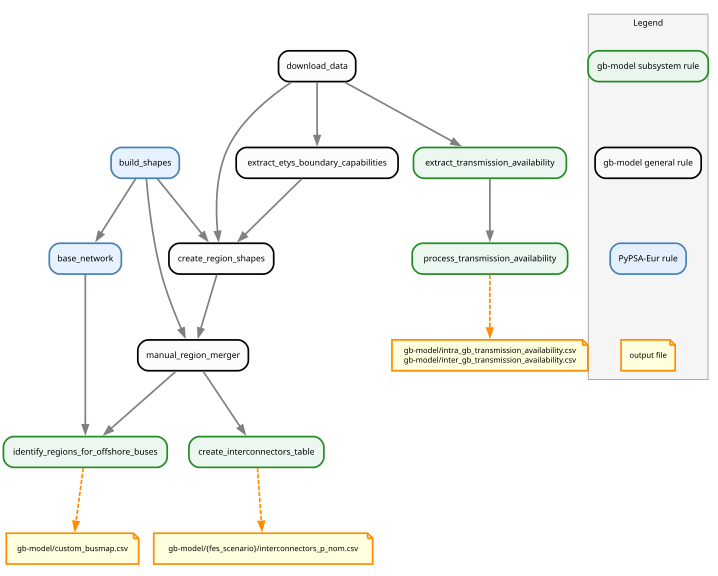

..
  SPDX-FileCopyrightText: Contributors to gb-dispatch-model <https://github.com/open-energy-transition/gb-dispatch-model>

  SPDX-License-Identifier: CC-BY-4.0

.. _transmission-system:

##########################################
Transmission System
##########################################

This page describes how the electricity transmission network is represented in the model, including AC lines, DC interconnectors, offshore bus mapping, and transmission availability.

Overview
========

The transmission network defines how power flows between buses in the model.
It spans both the internal GB meshed transmission system and the DC interconnectors linking GB to continental Europe and Ireland.

The network comprises three layers:

- **AC lines**: The internal GB high-voltage transmission grid, built from the OpenStreetMap (OSM) pre-built network and clustered to model regions
- **DC interconnectors**: Cross-border HVDC links connecting GB to neighbouring countries, sized by FES scenario and year
- **Offshore stub buses**: Offshore wind farm connection points that are mapped to their electrically connected onshore regional AC bus before clustering (not necessarily the geographically nearest one — see :doc:`data_cleaning`)

Transmission **availability** is accounted for through monthly unavailability fractions derived from NESO operational reports, applied separately to the intra-GB network and cross-border interconnectors.

The figure below gives a high-level view of the transmission pipeline:

.. graphviz::

   digraph {
      rankdir=LR;
      node [shape=box, style=filled];

      osm        [label="OSM pre-built\nnetwork", fillcolor="#B3D9FF"];
      neso_pdf   [label="NESO transmission\navailability reports\n(PDF)", fillcolor="#B3D9FF"];
      fes_plan   [label="FES interconnector\ncommissioning plan\n(config)", fillcolor="#B3D9FF"];
      regions    [label="Merged region\nshapes", fillcolor="#FFFACD"];

      busmap     [label="Offshore busmap\n(stub → region)", fillcolor="#FFFACD"];
      intercon   [label="interconnectors_p_nom.csv\n(MW per year)", fillcolor="#FFFACD"];
      avail_intra [label="intra_gb transmission\navailability (monthly)", fillcolor="#FFFACD"];
      avail_inter [label="inter_gb transmission\navailability (monthly)", fillcolor="#FFFACD"];

      network [label="PyPSA Network\n(Line, Link)", fillcolor="#90EE90", shape=ellipse];

      osm      -> busmap;
      regions  -> busmap;
      osm      -> network [label="AC lines\n(clustered)"];
      busmap   -> network [label="offshore bus\nmapping"];
      fes_plan -> intercon;
      regions  -> intercon;
      intercon -> network [label="DC links\n(p_nom per year)"];
      neso_pdf -> avail_intra;
      neso_pdf -> avail_inter;
      avail_intra -> network [label="line s_nom\nscaling"];
      avail_inter -> network [label="link p_nom\nscaling"];
   }

.. _transmission-data-sources:

Data Sources
============

OSM Pre-built Network — AC Grid Topology
-----------------------------------------

The internal GB transmission grid topology is read from a custom version of the **OpenStreetMap (OSM) pre-built network** maintained by the PyPSA-Eur pipeline.
The custom version extends the standard OSM extract to include voltage levels (132 kV, 275 kV, 400 kV) that are particularly relevant to the GB grid.

The network is configured via ``electricity.base_network: osm`` and the specific OSM archive version is pinned under ``data.osm``.

FES / Config — Interconnector Commissioning Plan
-------------------------------------------------

Cross-border DC interconnector capacities and their commissioning years are defined entirely in the configuration file under ``interconnectors``.
Each interconnector entry specifies:

- **Name**: project identifier
- **Neighbour**: country it connects to (converted to ISO2 country code for the PyPSA bus)
- **Capacity (MW)**: nominal power transfer capacity
- **TYNDP project ID and years**: cross-reference to the ENTSO-E Ten-Year Network Development Plan for traceability
- **Lat/lon**: approximate location of the GB connection point, used to assign the interconnector to the nearest model region

The ``interconnectors.plan`` section maps each FES scenario to a list of active interconnector projects by year, reflecting that different FES pathways assume different build-out of cross-border capacity.

NESO Transmission Availability Reports — Line Availability
-----------------------------------------------------------

Monthly transmission unavailability fractions are extracted from the **NESO operational transmission availability PDF reports**, covering years configured in ``transmission_availability.years`` (default 2020–2024).

Reports include:

- **Intra-GB**: Planned and unplanned unavailability (as a percentage) for each of the three GB Transmission Owner (TO) zones — NGET, SPT, and SHETL
- **Cross-border (interconnectors)**: Monthly unavailability percentage for each active interconnector project

These percentages are averaged over the configured year range to produce a stable monthly availability profile that is then applied as a ``p_nom`` or ``s_nom`` scaling factor for the simulated year.

.. _transmission-components:

System Components
=================

.. _transmission-ac-lines:

AC Lines
--------

**PyPSA Component**: ``Line`` connecting regional AC buses

The internal GB transmission grid is represented as a set of AC lines derived from the OSM pre-built network.
After OSM import and voltage filtering (retaining lines at the voltages listed in ``electricity.voltages``), the network is clustered to the model's regional resolution.

Offshore wind farm connection points appear as stub buses in the OSM network.
These are resolved to their nearest onshore regional bus via the ``identify_regions_for_offshore_buses`` rule before clustering (see :ref:`transmission-offshore-busmap`).

.. _transmission-interconnectors:

DC Interconnectors
------------------

**PyPSA Component**: ``Link`` with ``carrier = "DC"``

Cross-border DC interconnectors are added as bidirectional ``Link`` components (``p_min_pu = -1``) connecting a GB regional AC bus to the AC bus of the neighbouring country.

**Capacity**:

``p_nom`` is scenario- and year-dependent, following the FES commissioning plan:

- Interconnectors are accumulated year-by-year (``cumsum``), so a project commissioned in year *Y* remains active in all subsequent years
- The capacity represents the *one-directional* nameplate rating; bidirectional flow is enabled via ``p_min_pu = -1``
- Projects assigned to countries not included in the model scope (i.e., not in ``countries``) are silently excluded with a logged warning

Interconnector geometry (the shortest-path line from the GB connection lat/lon to the nearest point of the neighbouring country region) is synthesised and stored for visualisation.

.. _transmission-offshore-busmap:

Offshore Bus Mapping
--------------------

**PyPSA Component**: busmap used during network clustering

Offshore wind farms in the OSM network appear as stub buses outside the onshore regional boundaries.
Without correction, network clustering can assign these stubs to the geographically nearest region, which may differ from the region they are electrically connected to — inadvertently creating spurious cross-region transmission lines.

The ``identify_regions_for_offshore_buses`` rule resolves each offshore stub to its true onshore connection point and writes the result to ``resources/gb-model/custom_busmap.csv``, which is consumed by the PyPSA-Eur clustering step.

.. seealso::

   :doc:`data_cleaning` — detailed description of the offshore stub problem, the mapping algorithm, and illustrative figures.

.. _transmission-availability:

Transmission Availability
--------------------------

Monthly availability fractions are derived separately for intra-GB lines and cross-border interconnectors.

**Intra-GB (NGET, SPTL, SHETL)**:

Availability percentages are read from the NESO PDF reports for each TO zone and averaged over the configured report years.
Because the reports provide aggregate zone-level data (not line-by-line), the resulting fraction is applied uniformly to all lines within each zone.

To reflect the stochastic nature of outages, the monthly mean is converted to an hourly ``0/1`` availability series by random sampling: for each month, a fraction of hours equal to the mean unavailability percentage is drawn at random (using a fixed seed per zone for reproducibility) and marked as unavailable.
The complement gives the effective hourly ``s_nom_pu`` applied to lines in that zone.

**Cross-border interconnectors**:

Interconnector unavailability is averaged across all interconnector projects present in the reports and across report years.
A single monthly mean fraction is produced (``sample_hourly: false``), applied directly as a ``p_nom_pu`` scalar rather than sampled hourly.

.. _transmission-configuration:

Configuration
=============

Transmission availability data configuration:

.. literalinclude:: ../../config/config.gb.2024.yaml
   :language: yaml
   :start-after: # [doc:transmission-availability-config-start]
   :end-before: # [doc:transmission-availability-config-end]

.. _transmission-implementation-notes:

Implementation Notes
====================

**Data Processing Workflow**:

The transmission system is built through a pipeline implemented in ``rules/gb-model/transmission.smk``:

.. note::
   The graph above was generated using::

      pixi run filtered_rulegraph \
      "resources/GB/gb-model/HT/interconnectors_p_nom.csv
      resources/GB/gb-model/intra_gb_transmission_availability.csv
      resources/GB/gb-model/inter_gb_transmission_availability.csv
      resources/GB/gb-model/custom_busmap.csv" \
      "doc/gb-model/img/transmission_workflow.svg" \
      "-w fes_scenario" \
      "-s 10,8" \
      "-f rules/gb-model/transmission.smk"

   The ``filtered_rulegraph`` task allows us to trim the full DAG to transmission-related rules only.

1. **Extract availability** (``extract_transmission_availability``): Parses each NESO PDF report using ``pdfplumber``, extracting monthly unavailability tables for each TO zone and each interconnector project
2. **Process availability** (``process_transmission_availability``): Averages monthly unavailability across report years; for intra-GB zones, converts means to hourly ``0/1`` series by random sampling (reproducible via fixed seeds); for interconnectors, retains the monthly mean directly
3. **Interconnector table** (``create_interconnectors_table``): Reads the ``interconnectors.plan`` for the active FES scenario, accumulates capacity year-by-year, assigns each project to a GB model region using lat/lon point-in-polygon matching, computes line geometry (shortest path to neighbour country region), and outputs a per-year ``p_nom`` CSV
4. **Offshore busmap** (``identify_regions_for_offshore_buses``): Traverses the OSM base network graph to identify offshore stub buses and maps them to their onshore regional bus; iterates until all multi-hop offshore chains are resolved

**Key Assumptions**:

- **Uniform zone availability**: Intra-GB availability is applied at the TO zone level (NGET, SPTL, SHETL); individual line ratings within a zone are not differentiated
- **Interconnector availability**: A single aggregate monthly fraction is used for all interconnectors, averaged over all projects and report years
- **Reproducible random sampling**: Hourly availability realisation uses fixed random seeds per zone to ensure model results are reproducible across runs
- **Cumulative commissioning**: Interconnector capacities are accumulated forward in time — a project appearing in any year's plan remains active for all later years
- **Country scope filtering**: Interconnectors to countries not in the ``countries`` list are excluded; the model logs excluded projects at INFO level

.. seealso::

   **Related Documentation**:

   - :doc:`dispatch_redispatch` - Network constraints and redispatch using transmission capacity
   - :doc:`generators` - Generation assets connected to the same AC buses
   - :doc:`configuration` - Full configuration reference

   **External Resources**:

   - `OpenStreetMap / PyPSA-Eur OSM network <https://github.com/PyPSA/pypsa-eur>`_ - Base grid topology
   - `NESO transmission availability reports <https://www.neso.energy/>`_ - Source of intra-GB and interconnector availability data
   - `ENTSO-E TYNDP <https://tyndp.entsoe.eu/>`_ - Cross-border interconnector project reference
